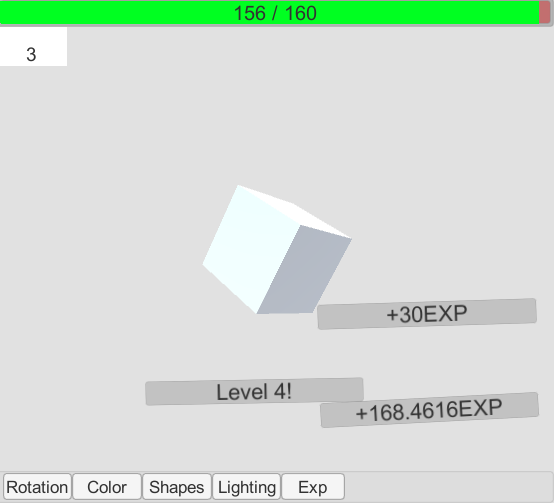

# SpinningCube
First Android Unity project

A basic Android Application that can be built and played either on a device as a .apk or within the unity editor.

Not a game, but a demonstration of C# scripting within unity to create an idle-clicker like EXP system.
A learning experience.

The cube spins on the screen at a slow rate initially, as the cube rotates every full rotation grants exp.
Upon leveling up the rotation speed is increased.
Saves player data on exit, loads on start.
If the app is closed, or otherwise suspended, when returning EXP is added for time spent away and awarded to player.

Feel free to use the UI buttons to force your speed to ridiculous amounts.
Other fun debugging options in there, as well as changing the color of the cube.

Have fun, feel free to make a pull request.

